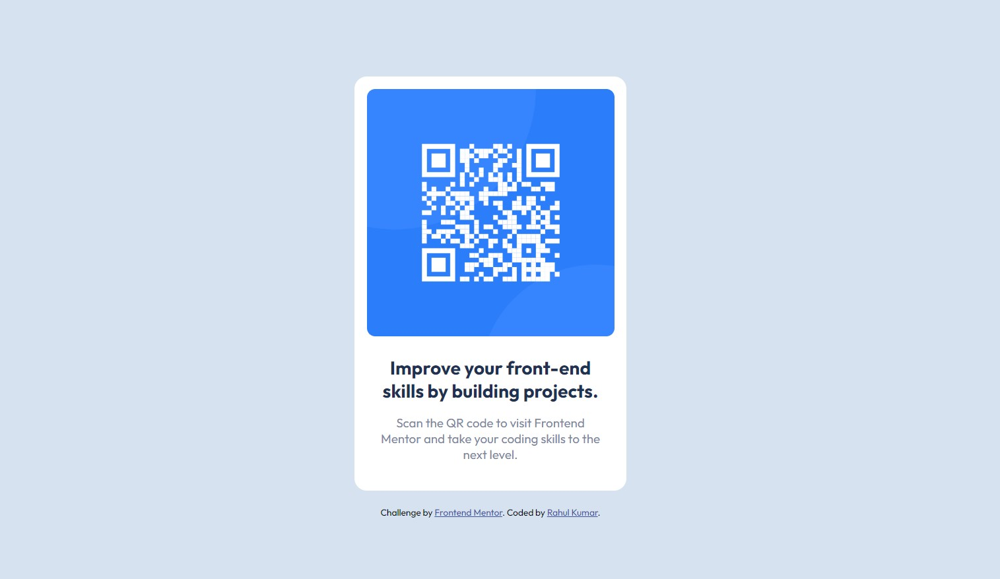

# Frontend Mentor - QR code component solution

This is a solution to the [QR code component challenge on Frontend Mentor](https://www.frontendmentor.io/challenges/qr-code-component-iux_sIO_H). Frontend Mentor challenges help you improve your coding skills by building realistic projects. 

## Table of contents

- [Overview](#overview)
- [Screenshot](#screenshot)
- [Links](#links)
- [Built with](#built-with)
- [What I learned](#what-i-learned)
- [Continued development](#continued-development)
- [Useful resources](#useful-resources)
- [Author](#author)
- [Acknowledgments](#acknowledgments)


## Overview

My challenge is to build out this QR code component and get it looking as close to the design as possible using the concepts of HTML and CSS.

### Screenshot




### Links

- Solution URL: [See my Solution](https://github.com/rahulsaw2003/qr-code-component)
- Live Site URL: [Visit my Live site](https://qr-code-component-mu-blush.vercel.app/)


### Built with

- Semantic HTML5 markup
- CSS custom properties
- Flexbox
- CSS Grid


### What I learned

Use this section to recap over some of your major learnings while working through this project. Writing these out and providing code samples of areas you want to highlight is a great way to reinforce your own knowledge.

```css
:root {
  --white: hsl(0, 0%, 100%);
  --light-gray: hsl(212, 45%, 89%);
  --grayish-blue: hsl(220, 15%, 55%);
  --dark-blue: hsl(218, 44%, 22%);
}
body {
    min-height: 100vh;
    align-items: center;
}
.container {
    max-width: 360px;
}

```

### Continued development

I felt that I am weak in  some css concepts, so first I will get to more comfortable with CSS. In my next project I will focus on mainly HTML and CSS. 


### Useful resources

- [MDN Dev Docs](https://developer.mozilla.org/) - This helped me for visualising. I really liked this pattern and will use it going forward.
- [W3 Schools](https://www.w3schools.com/) - This is an amazing article which helped me in syntax in CSS. I'd recommend it to anyone still learning this concept of Web development.


## Author

- Website - [Rahul Kumar Saw](https://rahulsaw2003.github.io/professional-website/)
- Frontend Mentor - [@rahulsaw2003](https://www.frontendmentor.io/profile/rahulsaw2003)


## Acknowledgments

As it was my first challenge I have taken some reference my youtube and learned some new concepts and applied those in this project.
